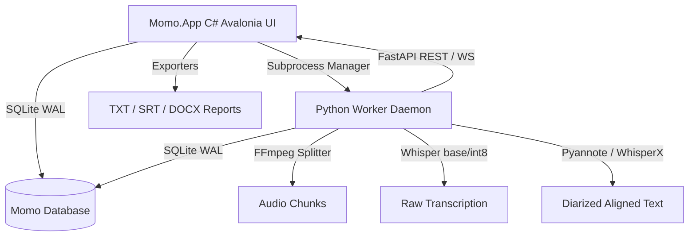

# Momo Enterprise Transcription Platform

Momo is a high-performance, enterprise-grade audio transcription, speaker diarization, and document alignment platform. It leverages a dual-engine architecture combining a high-performance **C# Host Application (Avalonia UI)** with a specialized **Python ML Worker Daemon (faster-whisper, Pyannote, and WhisperX)**.

---

## Current Release: Phase 2 (v2.0.0, 2026-06-22)
This release implements **VC Research Copilot** upgrades including dynamic domain glossaries, cross-file database speaker voiceprint memory, Stubble.Core Mustache template compilation, and the right-hand Avalonia settings panel.

*   For a complete list of updates, see [CHANGELOG.md](file:///d:/Antigravity/Project%203_Enterprise%20Momo/CHANGELOG.md).
*   For detailed verification results and implementation walkthrough, see [walkthrough.md](file:///C:/Users/User/.gemini/antigravity-ide/brain/c797f12e-b800-48cf-8be7-d1a4c090332c/walkthrough.md).

---

## System Architecture



---

## Projects Structure

*   **[src/Momo.App/](file:///d:/Antigravity/Project%203_Enterprise%20Momo/src/Momo.App)**: Desktop application built using Avalonia UI and MVVM design patterns.
*   **[src/Momo.Core/](file:///d:/Antigravity/Project%203_Enterprise%20Momo/src/Momo.Core)**: Core entity mappings, queue interfaces, and database schemas.
*   **[src/Momo.Infrastructure/](file:///d:/Antigravity/Project%203_Enterprise%20Momo/src/Momo.Infrastructure)**: Database initialization (WAL mode enabled), priority-based queue scheduling, subprocess control host, and TXT/SRT/DOCX exporters.
*   **[src/momo_worker/](file:///d:/Antigravity/Project%203_Enterprise%20Momo/src/momo_worker)**: Python FastAPI daemon server managing FFmpeg splitting, Silero VAD, faster-whisper transcribing, Pyannote diarization, and WhisperX alignment.
*   **[tests/Momo.Tests/](file:///d:/Antigravity/Project%203_Enterprise%20Momo/tests/Momo.Tests)**: Unit and integration test suites validating end-to-end transcription workflows, database locking, crash recovery, and export styles.

---

## How to Get Started

### Prerequisites
1.  **.NET 8.0 SDK**
2.  **FFmpeg** (installed globally or accessible in environment PATH)
3.  **Python 3.10** with configured virtual environment under `src/momo_worker/.venv`

### Run the Client Dashboard
1.  Open terminal in project root.
2.  Start the Avalonia desktop application:
    ```powershell
    dotnet run --project src/Momo.App/Momo.App.csproj
    ```

### Run Python Worker Independently (Debugging)
1.  Activate Python environment and run daemon:
    ```powershell
    cd src/momo_worker
    .\.venv\Scripts\python.exe main.py --port 5000 --db "D:\Antigravity\Project 3_Enterprise Momo\momo.db" --token "test"
    ```

---

## Running Automated Tests

To execute the unit and integration tests (excluding the heavy 1.8-hour verification test):
```powershell
dotnet test Momo.sln --logger:"console;verbosity=normal"
```

To run the full pipeline integration test including the 1.8-hour Plaud MP3 verification:
```powershell
$env:MOMO_RUN_REAL_TEST="true"
dotnet test Momo.sln --filter "FullyQualifiedName=Momo.Tests.IntegrationTests.Test_Real_Plaud_Verification" --logger:"console;verbosity=normal"
```
