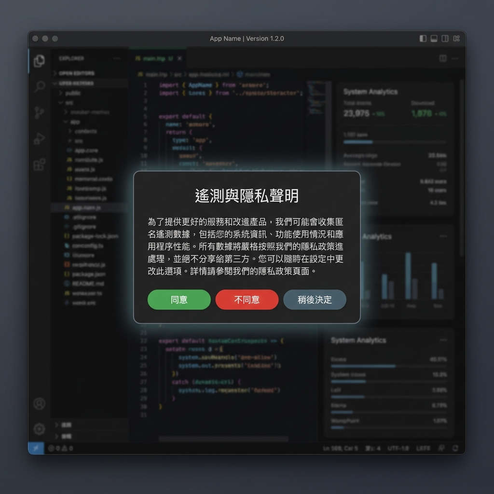
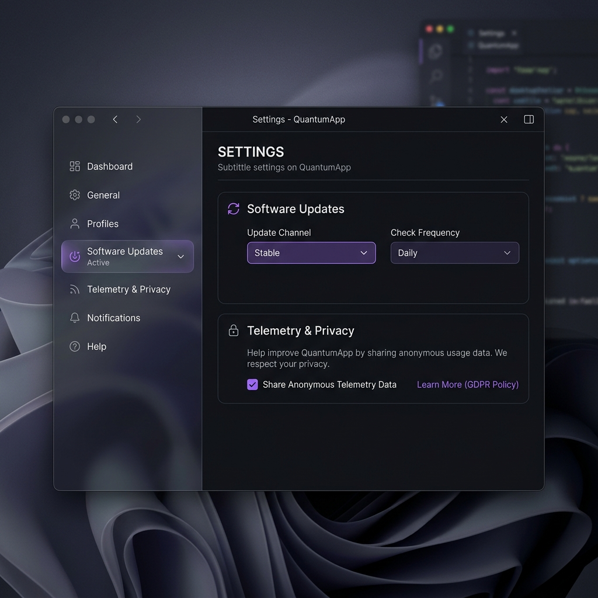

# Momo Desktop UI & Settings Guide

This document describes the software updates settings, telemetry privacy controls, GDPR modal prompt rules, and the dynamic localization system implemented in the Momo Transcription Platform.

---

## 1. Multi-Language Support (i18n)

The Momo Transcription Platform supports dynamic, on-the-fly language switching between **Traditional Chinese (zh-TW)** and **English (en-US)**.

* **Settings Interface**: You can toggle the language in the Settings Sidebar. The UI immediately refreshes all labels and layout alignment without requiring a system restart.
* **Culture Auto-detection**: On first boot, the platform auto-detects the operating system's default culture and selects the language (defaulting to `zh-TW` for Chinese locales and `en-US` for others).

---

## 2. GDPR & Telemetry Disclosures

To respect user privacy, the platform adheres to local-first offline execution. Anonymous telemetry is strictly **opt-in**.

* **GDPR Modal Prompt**: Upon first launch, the user is presented with a privacy prompt modal detailing data collection practices.
* **Agree**: Enables anonymous telemetry statistics.
* **Disagree**: Disables telemetry. No db records or network requests will be made.
* **Decide Later**: Closes the dialog without changing telemetry status. The system tracks this selection and will prompt the user one more time after 7 days. If the user does not opt in after two prompt iterations, the system will not prompt again.

---

## 3. Software Updates Settings

Software updates can be configured directly inside the sidebar Settings panel.

* **Update Channel**:
  - `stable`: Checks only for official releases.
  - `beta`: Checks for pre-releases and beta payloads.
* **Check Frequency**:
  - `Off`: Completely disables auto-checking (ideal for offline-only local-first environments).
  - `Daily`: Checks for updates once every 24 hours.
  - `Weekly`: Checks for updates once every 7 days.

---

## 4. Updates Notification & Changelog

When a background check discovers and downloads a new update package:
1. A dialog card pops up presenting the update's release notes (Changelog).
2. The Markdown-formatted release notes are parsed dynamically into clean text, including inline formatting, structured headers, and cached inline images.
3. The user can select **Install Now** (starts the installer and closes the app) or **Remind Later** (suppresses the update alert for the configured check frequency period).
