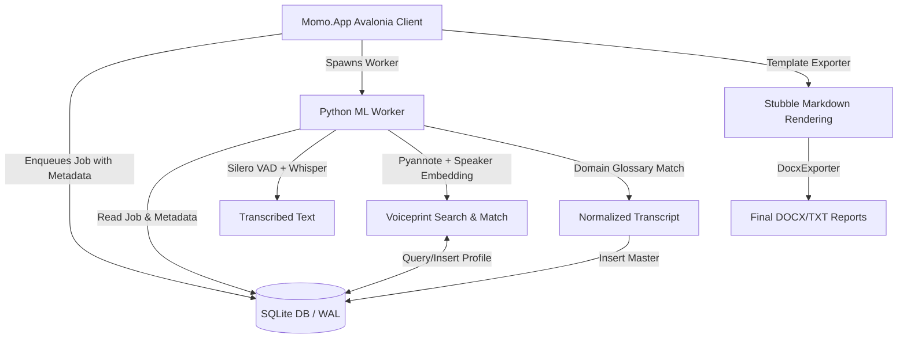
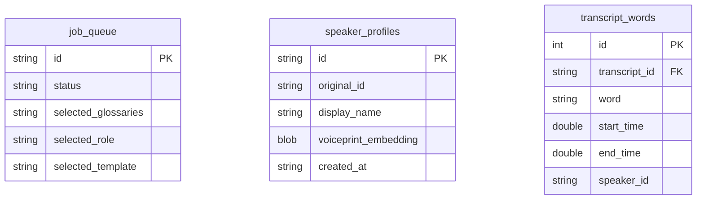

# Phase 2 Architecture Design: VC Research Copilot

This document defines the system architecture, database schema changes, IPC protocols, and software modules required to implement Phase 2: **Speaker Memory, Domain Glossary, Role & Template systems, and Settings Panel UI**.

---

## 1. System Overview

Phase 2 transforms the raw transcription platform into an intelligent Research Copilot. The enhanced architecture introduces:
1.  **Speaker Memory (聲紋記憶)**: Extracts 512-dimension speaker voiceprint embeddings using `pyannote/embedding`. Identifies and reconciles speakers globally across multiple audio files using SQLite database storage and Cosine Similarity thresholds.
2.  **Domain Glossary (專業詞庫)**: Dynamically replaces audio-transcribed acronyms, slang, and jargons with authoritative terms based on user-selected dictionary files, employing a compiled regex cache and priority sorting.
3.  **Role & Template System**: Utilizes YAML role prompts and Mustache-style templates (rendered via `Stubble.Core` NuGet library on Markdown then exported via `DocxExporter`) to structure transcription output.
4.  **Avalonia Panel UI**: A collapsible settings control panel on the right sidebar of the desktop client dashboard allowing users to select Glossaries, Roles, and Templates before enqueuing transcription jobs.



---

## 2. Database Schema Updates

To support Speaker Memory persistence and job settings metadata, we extend the SQLite schema with a new profile table and job configuration columns.



### 2.1 Table: `speaker_profiles` [NEW]
Persists voiceprint features (embeddings) of identified speakers.

| Column | Type | Constraints | Description |
| :--- | :---: | :--- | :--- |
| `id` | TEXT | PRIMARY KEY | Unique speaker profile ID (e.g. GUID). |
| `original_id` | TEXT | NOT NULL | Original speaker ID generated by Pyannote/Whisper (e.g., `Speaker_00`). |
| `display_name` | TEXT | NOT NULL | User-customized display alias. Defaults to original_id. |
| `voiceprint_embedding` | BLOB | NOT NULL | Binary serialized float array (512 floats) representing the voiceprint. |
| `created_at` | TEXT | NOT NULL | ISO-8601 timestamp. |

### 2.2 Table: `job_queue` [MODIFY]
Add new columns to save selections from the UI dashboard.

| Column | Type | Constraints | Description |
| :--- | :--- | :--- | :--- |
| `selected_glossaries` | TEXT | NULLABLE | JSON string list of glossary file names (e.g., `["medical.json", "finance.json"]`). |
| `selected_role` | TEXT | NULLABLE | File name of the selected role config (e.g., `vc_analyst.yaml`). |
| `selected_template` | TEXT | NULLABLE | File name of the selected exporter template (e.g., `pitch_deck.md`). |

---

## 3. Core Module Specifications

### 3.1 Speaker Memory (聲紋記憶)
*   **Embedding Extraction**: During Pyannote diarization, the Python worker extracts voiceprint embeddings for each speaker profile by calling the pre-trained `pyannote/embedding` model on cropped segment WAV files.
*   **Weighted Voiceprint Average**:
    For each speaker detected, compute a single weighted average embedding vector across all of their spoken audio segments, weighted by segment duration:
    $$\text{Embedding}_{\text{average}} = \frac{\sum (\text{Embedding}_{i} \times \text{Duration}_{i})}{\sum \text{Duration}_{i}}$$
*   **Cosine Similarity Matching**:
    $$\text{Similarity}(A, B) = \frac{A \cdot B}{\|A\| \|B\|}$$
    For every speaker detected in the new audio:
    1.  Query all existing records from the `speaker_profiles` table.
    2.  Calculate the Cosine Similarity between the new speaker's weighted average embedding and all stored profile embeddings.
    3.  If the maximum similarity is above the threshold (e.g., **0.80**), map the segments of the speaker to this existing profile.
    4.  If the similarity is below the threshold, insert a new record in `speaker_profiles` with a generated ID and write `display_name` defaulting to the raw speaker ID.
*   **Global Display Name Sync**:
    If the user modifies `display_name` in `speaker_profiles`, the change is instantly reflected on all subsequent exports of any transcripts referencing that speaker profile ID, keeping historic logs traceable via `original_id`.

### 3.2 Domain Glossary (專業詞庫)
*   **Storage**: Glossaries are stored in `glossaries/*.json` file format containing term mappings.
*   **Glossary Cache (`GlossaryCache`)**:
    Build a local in-memory compiled regex dictionary mapping terms to their normalized standard values to avoid compile bottlenecks during loop executions.
*   **Priority Ranking**:
    When multiple dictionaries are selected, apply replacements sequentially based on file priority (e.g., domain-specific dictionaries like `medical.json` replace terms before general dictionaries like `finance.json` to prevent cross-coverage collisions).
*   **Replacement Algorithm**:
    The processor executes case-insensitive word boundary replacements for all key-value entries:
    ```python
    # For each term in priority-sorted glossaries
    pattern = re.compile(r'\b(' + '|'.join(map(re.escape, glossary.keys())) + r')\b', re.IGNORECASE)
    text = pattern.sub(lambda x: glossary[x.group(0).lower()], text)
    ```

### 3.3 Role & ITemplateEngine Systems

#### 3.3.1 ITemplateEngine & Stubble.Core
Define an abstraction for the template compiler:
```csharp
public interface ITemplateEngine
{
    string Render(string templateContent, object context);
}
```
*   **Stubble.Core Integration**: Implements `ITemplateEngine` wrapping the Stubble engine to bind Markdown Mustache templates.
*   **DOCX Rendering Flow**:
    To avoid corrupting OpenXML tags inside Word, templates are first rendered to Markdown via `Stubble.Core`, and the resulting parsed paragraph array is written into the styled DOCX template structure using `DocxExporter`.

#### 3.3.2 Role Schema (`roles/*.yaml`)
Roles define post-processing prompts:
```yaml
name: "VC Pitch Evaluator"
goal: "Extract start-up core values, financial requests, market metrics, and target technologies."
output_sections:
  - title: "Business Summary"
    prompt: "Summarize the core business problems solved by the speaker."
  - title: "Financial Indicators"
    prompt: "Highlight the startup valuation, funding requests, and revenue metrics."
```

#### 3.3.3 Template Schema (`templates/*.md`)
```markdown
# Meeting Summary: {{ProjectName}}
* **Duration**: {{DurationMinutes}} minutes
* **Role**: {{RoleName}}

## Participant Highlights
{{#Speakers}}
* **{{SpeakerName}}**: {{SpeakerDuration}} seconds spoken.
{{/Speakers}}

## Structured Transcript
{{#Paragraphs}}
**[{{Timestamp}}] {{SpeakerName}}**: {{Text}}
{{/Paragraphs}}
```

---

## 4. UI Dashboard Settings Panel

We extend the desktop interface with a settings panel placed on the right sidebar of `MainWindow.axaml`.

*   **Collapsible Design**: The sidebar panel is collapsed by default to maximize the job queue list region. It slides out from the right upon clicking the settings icon.
*   **Glossary Multi-select List**: Queries files under `glossaries/` folder and shows check-boxes.
*   **Role Dropdown**: Queries files under `roles/` folder.
*   **Template Dropdown**: Queries files under `templates/` folder.
*   Selections are passed into the job request metadata.

---

## 5. Verification & Testing Matrix

### 5.1 Unit Tests
*   `Test_Glossary_Normalization`: Verifies dictionary replacements handle case sensitivity, priority order, and word boundaries.
*   `Test_SpeakerMemory_CrossFile`: Spawns two dummy audio files containing identical voices; asserts that the pipeline assigns the identical speaker profile ID to both runs.
*   `Test_Template_Export`: Feeds mock paragraph arrays into the C# rendering engine and validates that outputs conform to Mustache markdown templates.
*   **Fixtures**: Put two pre-recorded 10s audio files of the same speaker under `tests/Fixtures/` directory to run speaker memory voiceprint asserts.

### 5.2 Nightly Verification Integration Test
*   Applies full Silero VAD, Pyannote Speaker Diarization, and WhisperX alignment.
*   Runs against the 1.8-hour Plaud MP3 recording using the selected Role prompts and Mustache templates.
