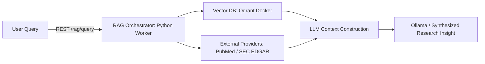

# Phase 3 Architecture Design: Multimodal Search, Live Streaming & Visualization

This document outlines the finalized design and architectural framework for the **Phase 3** development of the Momo Transcription Platform. It incorporates the approved decisions for Multimodal Search / RAG integration, Real-time Audio Streaming, and enhanced Frontend Visualization.

---

## 1. Multimodal Search & RAG Integration

To transform Momo from a raw transcription system into a fully context-aware VC Research Copilot, we integrate a Retrieval-Augmented Generation (RAG) pipeline.

### Architectural Layout

### Components
1. **RAG Orchestrator**: Hosted on the **Python Worker side** (Option A). The C# application invokes `/rag/query` and `/rag/ingest` HTTP endpoints. This keeps ML dependencies centralized.
2. **Vector DB (Qdrant)**:
   * **Embedding Model**: Local `sentence-transformers` running `all-MiniLM-L6-v2` inside the Python worker daemon (Option A). Ingestion and retrieval run fully offline.
   * **Storage**: Qdrant running as a Docker container. It indexes segmented transcript paragraphs alongside external document crawls.
3. **External Knowledge Providers**:
   * **PubMed Provider**: Fetches biomedical and clinical trial literature dynamically based on extracted glossary entities. Runs anonymously via NCBI E-Utilities, with support for an optional `PUBMED_API_KEY` environment variable.
   * **SEC EDGAR Provider**: Fetches corporate quarterly reports and financial filings. Headers comply with SEC user-agent specifications (configured dynamically via `appsettings.json` on the C# side and passed to the worker).
4. **Hybrid Search**: Combines BM25 keyword matching with dense vector cosine similarity search to surface relevant context.

---

## 2. Real-time Recording & Streaming (PoC)

Live monitoring capabilities allow users to view running transcriptions and speaker identity assignments in real-time.

### Proposed Streaming Pipe
* **Client Audio Capture**: The C# desktop client captures mono PCM audio stream, slicing it into 5-second buffer intervals.
* **WebSocket Connection**: The client establishes a WebSocket connection `ws://127.0.0.1:5000/ws/live-stream` to push the raw audio chunks.
* **Python Real-time Worker**:
  * Runs a lightweight **local Whisper tiny model in int8 quantization** (Option A) on CPU threads.
  * Emits streaming segment lists with transient speaker identities and confidence scores back via the WebSocket connection.
* **UI Live Caption Panel**: An Avalonia visual sub-panel displaying text scrolling in real-time as chunks get completed.

---

## 3. Frontend Visualization Enhancements

To make the transcribed data navigable for venture capital analysis, the dashboard UI includes:

1. **Speaker Timeline Block Panel**:
   * Represents speaker turns as colored horizontal blocks along a chronological timeline.
   * Clicking a block jumps the audio player head directly to that segment's start time.
2. **Keyword Tag Cloud**:
   * Extracts keywords dynamically based on the selected **Domain Glossary** matches and term frequency-inverse document frequency (TF-IDF).
   * Renders keyword tag clouds with font sizes indicating density. Clicking a tag highlights occurrences in the transcript text and filters the timeline.
