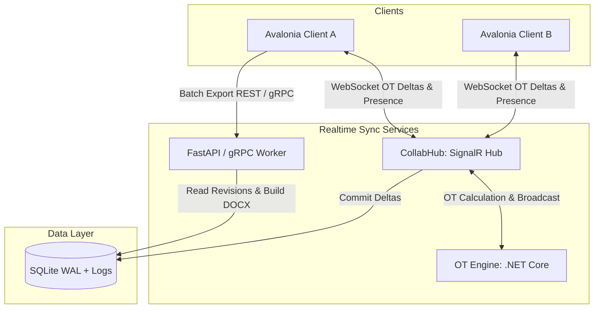

# Phase 4 Architecture Draft: Collaboration & Versioning

This document outlines the architecture design and core modules planned for **Phase 4: Collaboration & Versioning** of the Momo Transcription Platform.

---

## 1. Goal & Value

*   **Multiplayer Collaboration**: Allow multiple analysts to open the same transcript concurrently, enabling real-time synchronizations of text edits, cursor positions, and selections.
*   **Versioning & History Controls**: Track and retain granular edit histories, support visual difference (diff) comparisons, allow reverting to previous revisions, and embed Track Changes (inserts/deletions) directly into DOCX document exports.
*   **Threaded Comments & Task Assignments**: Implement paragraph- and sentence-level comments with thread replies. Allow assigning tasks/resolutions to specific users and tracking state status (Open / Resolved).

---

## 2. Architecture & Concept Diagram

---

## 3. Core Modules

| Module Name | Core Responsibility |
| :--- | :--- |
| **CollabHub (ASP.NET Core SignalR)** | Manages WebSocket connections, tracks user presence and active cursor positions, and broadcasts OT delta payloads to active workspace sessions. |
| **OT Engine (.NET)** | Processes text Operational Transforms (OT). Supports operations like `insert`, `delete`, and `format` at both character and paragraph levels. |
| **Comment Service (Python FastAPI)** | Exposes RESTful CRUD APIs (`/comments`), links records in SQLite database tables, and routes user mention notifications. |
| **Versioning Service** | Creates a new Revision snapshot on Save events, processes difference metrics via standard diff algorithms, and structures Track Changes within OpenXML DOCX files. |
